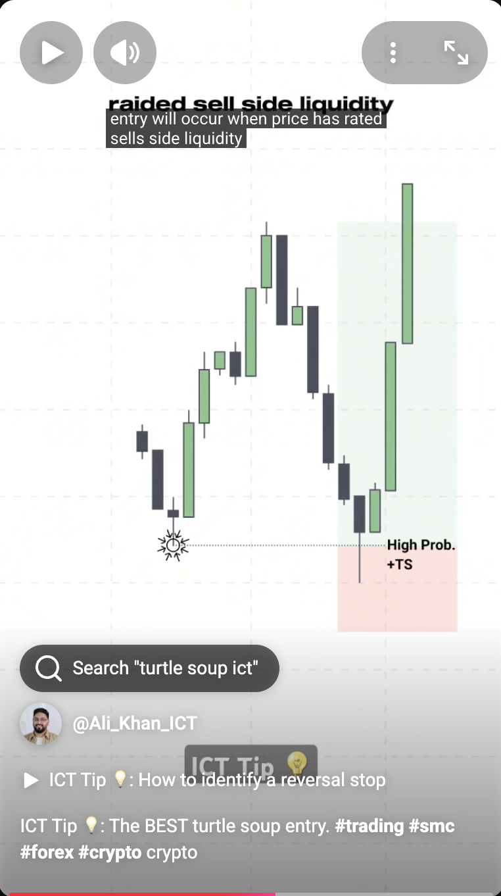

# Market Profile
**Market Profile:** _Is a concept that classifies what type of trading enviroment the current market enviroment is currently trading within_

## Consolidation Range Profile
- Consolidation happens in any timeframe
- You want to look for the directional bias
    - Smart Money will leave tips and clues so you can know what direction the expansion will take after the Consolidation
- If it is a bearish market, you prob want to look for shorts in the HTF
- Markets goes from Consolidation then to Swing then back to Consolidation
    - You want to jump in right before the swing happen
- Don't chase the market, wait for it to come. You should already be in the market before the BOS

## Turtle Soup Entry
- When price has swept a sell-side or buy-side liquidity, below a previous low or high, then we look for the reversal

1. Asia Builds the Range and Liquidity Pool
    - This is the range that London and NY will use to sweep liquidity 
2. Sweeps one side
    - London will sweep either Asia high or low
        - This is also known as The Judas Swing Liquidity
3. New York does the expansion - The Real Move
    - NY will tend to sweep the opposite side of what London swept.
      - So if London swept Asia High, you can expect NY to aim to sweep Asia Low
        - NY will sweep what London did not sweep. The opposite.

    _NY can also go for the PDH/PDL. It is recommended to watch for the daily/weekly/4hr bias to confirm the direction of the market and which liq pool to grab_

    _Monday is used to create the range and liquidity pool for the week. The H/L for the week is usually created on Monday. It's not recommended to use this strategy for Monday_
