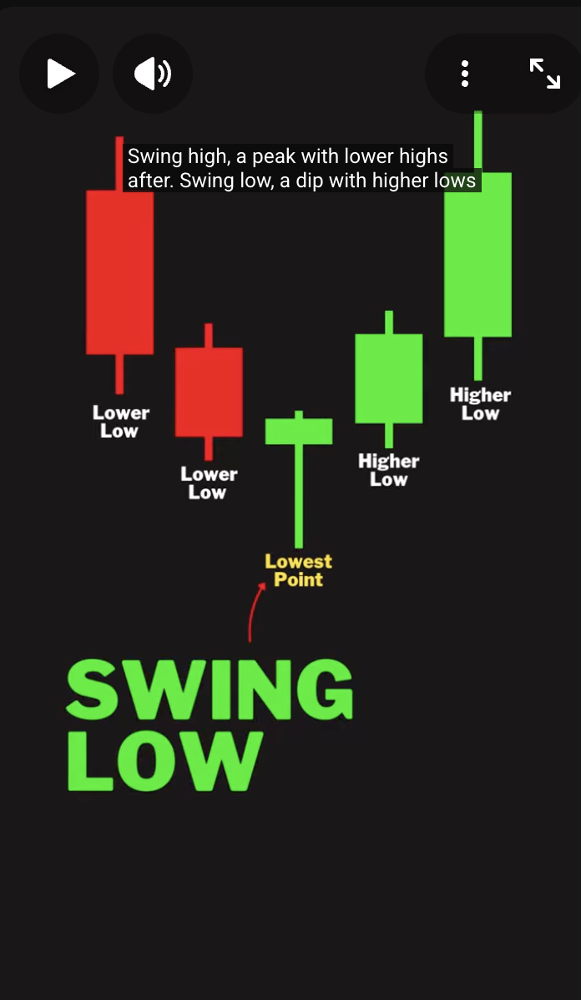
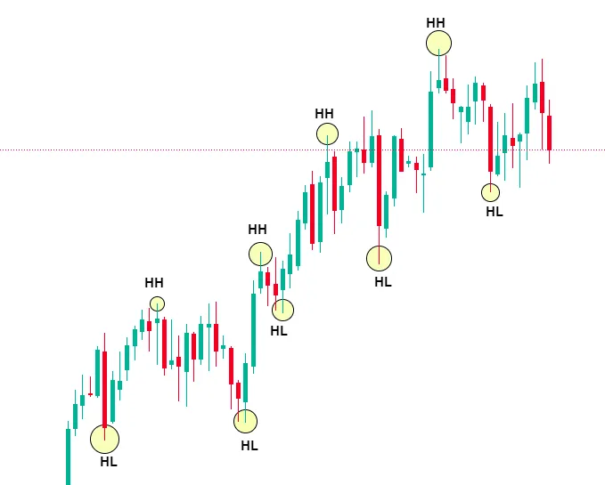
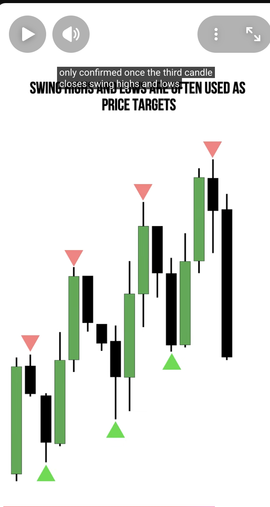
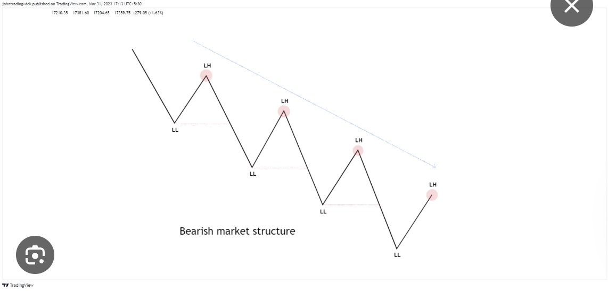

# Market Profile
**Market Profile:** _Is a concept that classifies what type of trading enviroment the current market enviroment is currently trading within_

## Consolidation Range Profile
- Consolidation happens in any timeframe
- You want to look for the directional bias
    - Smart Money will leave tips and clues so you can know what direction the expansion will take after the Consolidation
- If it is a bearish market, you prob want to look for shorts in the HTF
- Markets goes from Consolidation then to Swing then back to Consolidation
    - You want to jump in right before the swing happen
- Don't chase the market, wait for it to come. You should already be in the market before the BOS

## Turtle Soup Entry
- When price has swept a sell-side or buy-side liquidity, below a previous low or high, then we look for the reversal

1. Asia Builds the Range and Liquidity Pool
    - This is the range that London and NY will use to sweep liquidity 
2. Sweeps one side
    - London will sweep either Asia high or low
        - This is also known as The Judas Swing Liquidity
3. New York does the expansion - The Real Move
    - NY will tend to sweep the opposite side of what London swept.
      - So if London swept Asia High, you can expect NY to aim to sweep Asia Low
        - NY will sweep what London did not sweep. The opposite.

    _NY can also go for the PDH/PDL. It is recommended to watch for the daily/weekly/4hr bias to confirm the direction of the market and which liq pool to grab_

    _Monday is used to create the range and liquidity pool for the week. The H/L for the week is usually created on Monday. It's not recommended to use this strategy for Monday_

       don't chase the market. We need to catch it before the swing happens. If prices start to run, don't chase it. Leave it and wait for the next consolidation

## Market Structure
### Bullish Market Structure
- Bullish Market Structure consist of swing highs and swing lows. 
    - Price goes from ERL to IRL
        - Swing high consist of LH > HH > LH
            - 
        - Swing low consist of HL > LL > HL
            - 
        - 
    - Price must break the previous high in order to be a new swing high point
        - 
        - 
    - Swing lows and swing highs that are internal to a range (between Swings) is not a Market Structure
- If the market is at an uptrend the new high must close past the previous swing high to be able to mark the new low and the new

### Bearish Market Structure
- A market making lower lows, and lower highs trend
- If the market is at a downtrend, the new low must break the previous low
    - 
    - 
- External swing low and internal swing high

- It's good to wait for both side to have 2 swings. That is a STRONG swing 
    - Candle 1 SH  
    - Candle 2 SH   
    - Candle Swing Low   
    - Candle 3 SH
    - Candle 4 SH     

### Manipulation vs Displacement
- Displacement: _Strong, energetic price movement that shows genuine institutional participation (smart money). Smart money is actively moving the market in that direction_
    - Aggressive push past key levels (highs/lows)
    - Strong momemtum with follow through candles, **sustained movement**
    - Large Candles
    - Closes well beyond the broken level
    - Followed by retracement and then continuation
- Manipulation: _Weak, but rapid price movement designed to trap retail traders and gather liquidity. False moves to take out stops and breakout traders before the real move_
    - Barely breaks previous highs/lows
    - Weak follow-throughs
    - Quick reversal
    - Often reverse quickly in the opposite direction
## Premium and Discount
[Recommended Video](https://www.youtube.com/watch?v=IynpGS5tUDE)
1. You need a swing high and a swing low
2. Fib tool
    - Anything above Equlibrium / Mean Threshold
    - Premium is anything above the Equlibrium
    - Discount is anything below Equlibrium
        - 
3. This is mainly for buying/selling bias
    - If price is in premium, you want to sell
    - If price is in discount, you want to buy
4. How to use:
    - This is only to be used as market bias
    - Sell at a _premium_ 
        - when it is above the Equlibrium
    - Buy at a _discount_ 
        - when it is below the Equlibrium
5. Placement:
    - In *Bullish* market you start from top down
    - In *Bearish* market you start from bottom up
    - Forms at each SH/SL
    
## Market Structure Shift
- When the market shift to the opposite directions
    - You are looking for a FVG or PDArray for entry point
- When the market shift from HL/HL to LH/LL