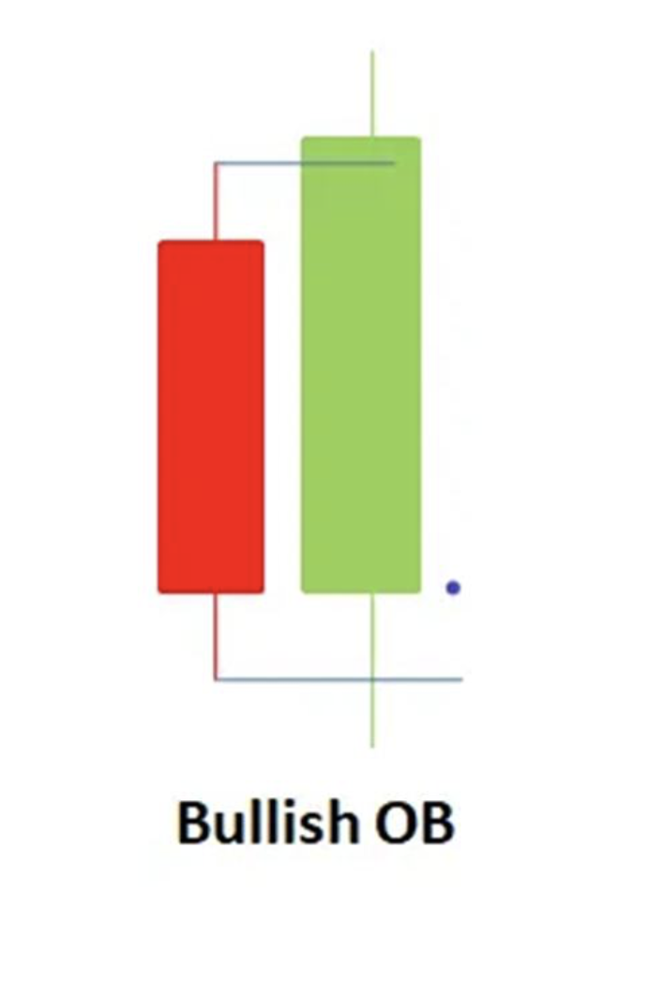
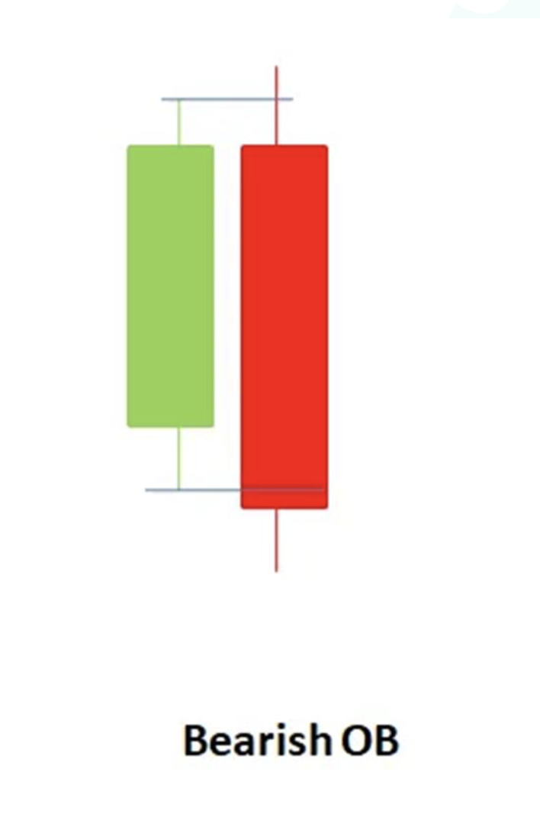

# Chapter 2 - PD-Array
PD-Array stands for *Premium Discount Arrangement*

[See this section for more on **<u>Premium and Discount</u>**](/docs/Development-Lesson-2.md#premium-and-discount)

## Different type of PD-Arrays
- ### Order Blocks
    - **Bullish Order Block:** occurs when a *bullish* candle body (not wick) engulfs a *bearish* candle before a displacement.
    
        - * displacement is the confirmation, but the entry point would be a retracel back to the order block *
    - **Bearish Order Block:** occurs when a *bearish* candle body (not wick) engulfs a *bullish* candle before a displacement.
    
        - *displacement is the confirmation, but the entry point would be a retracel back to the order block*
    - The order block process is predisposed with the sweep of liquidity. After institutions has swept liquidity, then the reversal is being staged. The start of the reversal is usually an OB, followed by a displacement. From there you can expect price to retrace back to the OB, as anywhere there is an FVG, a retracal is emminent as there is an inbalance and orders that needs to be filled. 
        - You can validate this with the volumes-range indicator
    - Once price retraces and price is balanced, then go for a long, if it is a bearish order block, vice-versa