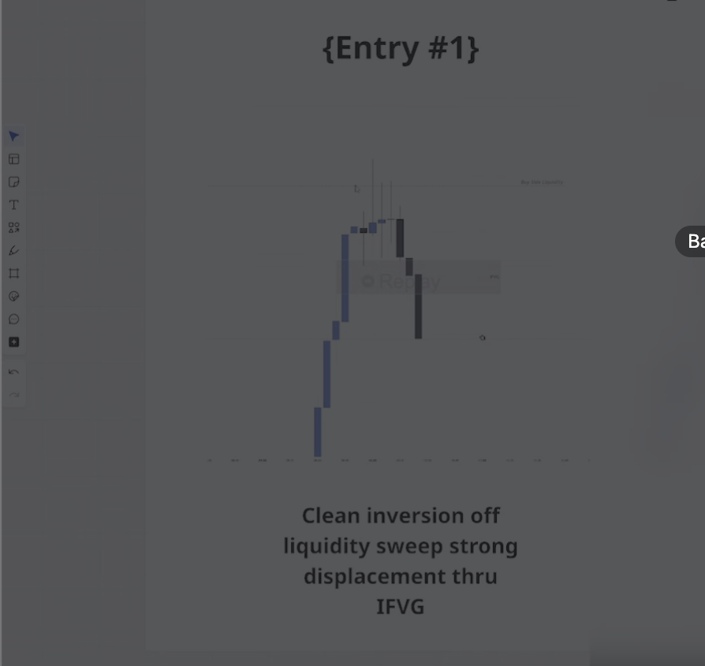

# Strategy

## Jayden Meyerink
### Rules and Principles
#### Max risk per trade
- [ ] Set a Risk to Reward in place that is the crux of all your trading decisions
  - Don't risk more than your allocated amount for each trade
- [ ] It should take you 10 trades before blowing account up
  - So if MLL is $2000, then it should be 2000 / 10 
    - That should be the risk amount per trade
- [ ] Max trade per session, then walk away
  - You should not take more than X amount of trades per day
- [ ] Only trade your setup and nothing else

### IFVG Strategy
#### Catch reversal
  - [ ] Sweep any major liqudity
  - [ ] Look for an IFVG to the FVG that swept liqudity
    - [ ] Stop loss gors at the swing high/swing low that swept liqudity and then put your stop loss at next liquidity level
- [ ] 1m or 5m timeframe
### Entry Signal
- [ ] Clean invesion off of the liquidity sweep, strong displacement through IFVG 
- [ ] Enter opposite direction of the original FVG that got violated
    - Confirmation that Smart Money wanted to grab S/L above the liquidity and then reversing the opposite direction
- [ ] Retracement will also work

    - 
### Opening Range Break
- Catch expanding markets
- [ ] First 15-minute candle high and low
- [ ] Drop down to lower time frame
- [ ] Wait for clear displacement through the range
    - Big strong aggresive candle that closes through the range 
        - FVG
- [ ] You can come in when candle close, or retest
- [ ] Stop loss goes at the candle that caused the displacement
    - Don't want to see price come back up to the range
    - 2:1 RR
### Entry Signal
    - You can do in 5, 15, or 30 minute candle
    - [ ] Mark the high and low with 15 min candle
    - [ ] Go to 5 min time frame
    - [ ] Breaks range with strong displacement
    - [ ] S/L on the candle low that caused the displacement
    - [ ] DISPLACEMENT IS A MUST
    - [ ] Some people wait for retest, some don't. Just manage your emotions
### THE ICT BREAKER MODEL
  - [ ] OB forms
  - [ ] Displacement forms (with FVG)
  - [ ] Retrace into the OB
  - [ ] OB FAILS (price trades THROUGH it)
  - [ ] Displacement in the opposite direction
  - [ ] The FAILED OB becomes the Breaker Block
  - [ ] Retrace to the Breaker → ENTRY
### Implied Fair Value Gap
  - [ ] HTF
  - [ ] Wait for a liquidity grab
  - [ ] MSS
  - [ ] IFVG
  - [ ] Once price taps back into IFVG, go for long
### Rejection Block
  *[Sample](https://youtube.com/shorts/BvezXyLmieg?si=8ULSy5BFi81ONn6i)*
  *[Sample](https://youtube.com/shorts/l5OIy2n9BQ0?si=0zaIvA9bu1eafsdK)*
  *[Sample](https://youtu.be/9NDGx9MYuXw?si=yqjltnk0YDlV6ySh)*
	-	[ ] Market takes sell/buy-side liquidity
	-	[ ] Forms a bullish/bearish rejection candle
	-	[ ] MSS/BOS (A candle opposite of the RB candle)
    - [ ] That candle must tap into the RB zone, and then push back the opposite direction
    - [ ] The candle that taps into the rejection block does NOT have to be the very next candle.
      - [ ] it MUST happen within a reasonable number of candles.
	-	[ ] Stops below the rejection wick
### Mitigation Block
	-	[ ] Identify a prior OB
	-	[ ] Price violates that OB or it fails
	-	[ ] Price later returns to the body of that failed OB
	-	[ ] That returned candle becomes the Mitigation Block
	-	[ ] Enter the direction of the returned candle, the mitigation
	-	[ ] Stop-loss at the lowest wick for that the wick 
    - [ ] Price should contineu aggresive and should not return to that level
	-	Target higher liquidity

## Hints/Tips:

### Timeframe:
Day Trading: Focus on 1H down to 5M
Swing Trading: Daily down to 1H
Position Trading: Weekly/Monthly down to Daily

