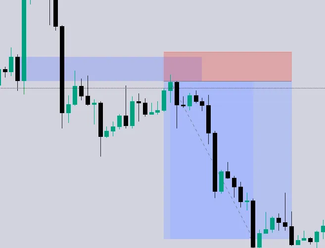

# Strategy

- ## ICT Strategies
  - **Rebalancing IFVG Strategy**
      - [ ] FVG must form after a liqudity sweep, or real displacement
      - [ ] Break of a swing structure, Momentum shift
      - [ ] The FVG MUST be violated
      - [ ] The IFVG must close beyone the FVG close point
        - If the FVG exists randomly in the middle of consolidation, ignore it.
        - Should not happen directly after an FVG was formed, that is a false move, as FVG should lead to MSS
        - MSS happens when price takes out a swing in the OPPOSITE direction
        - Price breaks a bullish swing low
      - [ ] Price must retrace back into the original FVG direction into the IFVG zone
    - **Catch IFVG Reversal**
      - [ ] Sweep any major liqudity
      - [ ] Look for an IFVG to the FVG that swept liqudity
        - [ ] Stop loss gors at the swing high/swing low that swept liqudity and then put your stop loss at next liquidity level
      - [ ] 1m or 5m timeframe
    - **Entry Signal**
      - [ ] Clean invesion off of the liquidity sweep, strong displacement through IFVG 
      - [ ] Enter opposite direction of the original FVG that got violated
          - Confirmation that Smart Money wanted to grab S/L above the liquidity and then reversing the opposite direction
      - [ ] Retracement will also work
  span>
      - [ ] FVG must form after a liqudity sweep, or real displacement
      - [ ] Break of a swing structure, Momentum shift
      - [ ] The FVG MUST be violated
      - [ ] The IFVG must close beyone the FVG close point
        - If the FVG exists randomly in the middle of consolidation, ignore it.
        - Should not happen directly after an FVG was formed, that is a false move, as FVG should lead to MSS
        - MSS happens when price takes out a swing in the OPPOSITE direction
        - Price breaks a bullish swing low
      - [ ] Price must retrace back into the original FVG direction into the IFVG zone
    - **Catch IFVG Reversal**
      - [ ] Sweep any major liqudity
      - [ ] Look for an IFVG to the FVG that swept liqudity
        - [ ] Stop loss gors at the swing high/swing low that swept liqudity and then put your stop loss at next liquidity level
      - [ ] 1m or 5m timeframe
    - **Entry Signal**
      - [ ] Clean invesion off of the liquidity sweep, strong displacement through IFVG 
      - [ ] Enter opposite direction of the original FVG that got violated
          - Confirmation that Smart Money wanted to grab S/L above the liquidity and then reversing the opposite direction
      - [ ] Retracement will also work
  - **Breaker Block**
    - More info: 
      - [Breaker Blocks](ICT-Book/chapter2/#breaker-blocks) 
    - Strategy:
      - [ ] Look for an OB to be violated
      - [ ] Once the price closes with correct OB violation
        - [ ] Bearish OB, looks for price to close below the low of the OB
        - [ ] Bullish OB, looks for price to close above the high of the OB
      - [ ] Look for price to retest the bearish breaker block, then enter
        - [ ] If bearish breaker block, place S/L above the high of the breaker block
          - 
        - [ ] If bullish breaker block, place the S/L above the high of the breaker block
          - [ ] 
    - Timeframe
      - If breaker block is being used for daily bias, use it on daily timeframe
      - If breaker block is being used as an ICT PD-ARRAY to execute trade, you should use it for lower timeframe of 15min or 5min
  - **Opening Range Break** - <u>*casper*</u>
    - Catch expanding markets
    - [ ] First 15-minute candle high and low
    - [ ] Drop down to lower time frame
    - [ ] Wait for clear displacement through the range
        - Big strong aggresive candle that closes through the range 
            - FVG
    - [ ] You can come in when candle close, or retest
    - [ ] Stop loss goes at the candle that caused the displacement
        - Don't want to see price come back up to the range
        - 2:1 RR
    - **Entry Signal**
        - [ ] You can do in 5, 15, or 30 minute candle
        - [ ] Mark the high and low with 15 min candle
        - [ ] Go to 5 min time frame
        - [ ] Breaks range with strong displacement
        - [ ] S/L on the candle low that caused the displacement
        - [ ] DISPLACEMENT IS A MUST
        - [ ] Some people wait for retest, some don't. Just manage your emotions
  - **The ICT Breaker Model**
      - [ ] OB forms
      - [ ] Displacement forms (with FVG)
      - [ ] Retrace into the OB
      - [ ] OB FAILS (price trades THROUGH it)
      - [ ] Displacement in the opposite direction
      - [ ] The FAILED OB becomes the Breaker Block
      - [ ] Retrace to the Breaker → ENTRY
  - **Implied Fair Value Gap**
      - [ ] HTF
      - [ ] Wait for a liquidity grab
      - [ ] MSS
      - [ ] IFVG
      - [ ] Once price taps back into IFVG, go for long
  - **Rejection Block**
      *[Sample 1](https://youtube.com/shorts/BvezXyLmieg?si=8ULSy5BFi81ONn6i)*
      *[Sample 2](https://youtube.com/shorts/l5OIy2n9BQ0?si=0zaIvA9bu1eafsdK)*
      *[Sample 3](https://youtu.be/9NDGx9MYuXw?si=yqjltnk0YDlV6ySh)*
      -	[ ] Market takes sell/buy-side liquidity
      -	[ ] Forms a bullish/bearish rejection candle
      -	[ ] MSS/BOS (A candle opposite of the RB candle)
        - [ ] That candle must tap into the RB zone, and then push back the opposite direction
        - [ ] The candle that taps into the rejection block does NOT have to be the very next candle.
          - [ ] it MUST happen within a reasonable number of candles.
      -	[ ] Stops below the rejection wick
  - **Mitigation Block**
      -	[ ] Identify a prior OB
      -	[ ] Price violates that OB or it fails
      -	[ ] Price later returns to the body of that failed OB
      -	[ ] That returned candle becomes the Mitigation Block
      -	[ ] Enter the direction of the returned candle, the mitigation
      -	[ ] Stop-loss at the lowest wick for that the wick 
        - [ ] Price should contineu aggresive and should not return to that level
      -	[ ] Target higher liquidity
  - **Dealing Range**
      - [ ] Is there a Dealing Range
      - [ ] Is there an FVG within the dealing range
      - [ ] Did price retrace into the FVG zone forming an IFVG
      - [ ] Enter
        - [ ] Additionally, you can mark if price hit the Dealing Range high/low again, that is sign of a MSS
  - **Liquidity Void**
     - Option 1
        - [ ] Price must return to rebalance the inefficiences/void, then once it rebalnace price, it returns back to it's original direction
     - Option 2
        - [ ] Price moves fast because there is nothing to slow it down
        - [ ] Enter into the direciton of the void, till price retraces 
  - **Order Block**
      -	[ ] Engulfing candle - *5 min entry*
        - *Market takes sell/buy-side liquidity - optional*
        - *Liquidity sweep is not needed, but it makes your entry stronger*
      -	[ ] Forms a 3 candle FVG - MSS/BOS
          - *1 min entry confirm with 5 min HTF*
        - Displacement MUST happen within a reasonable number of candles, however, is does not need to be directly after the OB. 
          - *The closer it is to the OB, the stronger the entry*
      - Stop/Loss:
        1. Recommended: Stops loss can go under the engulfing candle that formed the OB
        2. Tighter R:R It can also go under the candle that formed the displacement 
- ## Hints/Tips:
  - **Timeframe**
    - Day Trading: Focus on 1H down to 5M
    - Swing Trading: Daily down to 1H
    - Position Trading: Weekly/Monthly down to Daily
  - **Max risk per trade**
    - [ ] Set a Risk to Reward in place that is the crux of all your trading decisions
      - Don't risk more than your allocated amount for each trade
    - [ ] It should take you 10 trades before blowing account up
      - So if MLL is $2000, then it should be 2000 / 10 
        - That should be the risk amount per trade
    - [ ] Max trade per session, then walk away
      - You should not take more than X amount of trades per day
    - [ ] Only trade your setup and nothing else